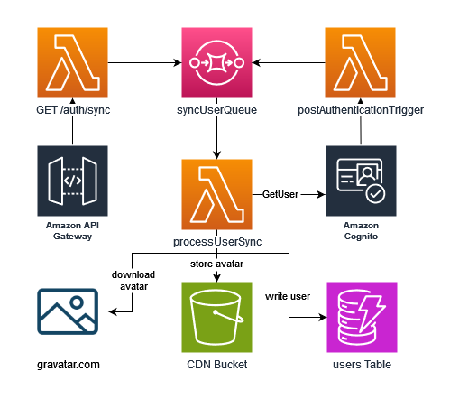

# Core Microservice

This repo is an amalgamation of resources that are generally independent of any specific service. It also contains most, if not _all_
of the DNS records because that means only having cloudflare credentials in one place.

## Auth

This microservice also contains all of the infrastructure for authentication, one of the reasons for doing so is that
there are many place down-stream that need to reference variables (e.g. user pool ID) from here, keeping it all in core
prevents adding additional complexity of having multiple pre-requisite microservices that need to be deployed first.

### User Sync

To make querying easier (since the cognito APIs are limited ot say the least) the user data is synchronised to a DynamoDB table,
this is done automatically when a used logs in and manually via API gateway, the gateway endpoint is mostly designed for the UI to
ensure syncing after a user self-updates their attributes (e.g. display name).

As part of this process we also download and cache the users Gravatar (if they have it enabled), this is both so that we are not relying
on external providers and not publicly listing an MD5 hash of the users email address.

