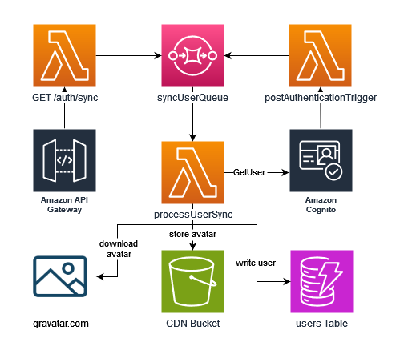
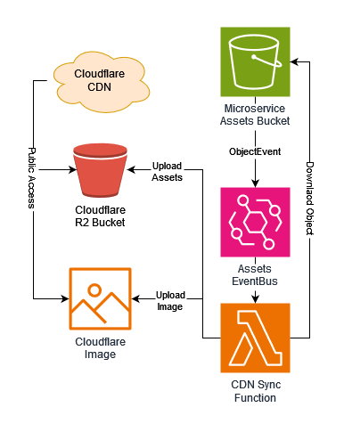

# Core Microservice

This repo is an amalgamation of resources that are generally independent of any specific service. It also contains most, if not _all_
of the DNS records because that means only having cloudflare credentials in one place.

## Auth

This microservice also contains all of the infrastructure for authentication, one of the reasons for doing so is that
there are many place down-stream that need to reference variables (e.g. user pool ID) from here, keeping it all in core
prevents adding additional complexity of having multiple pre-requisite microservices that need to be deployed first.

### User Sync

To make querying easier (since the cognito APIs are limited ot say the least) the user data is synchronised to a DynamoDB table,
this is done automatically when a used logs in and manually via API gateway, the gateway endpoint is mostly designed for the UI to
ensure syncing after a user self-updates their attributes (e.g. display name).

As part of this process we also download and cache the users Gravatar (if they have it enabled), this is both so that we are not relying
on external providers and not publicly listing an MD5 hash of the users email address.



### CDN

While each microservice retains ultimate control of their own asset file, there is an automated system in place that will
download the assets from each of the individual buckets and upload them to a centralised location on Cloudflare. This is
done both so that there is only a single public subdomain for accessing the files, to reduce bandwidth costs, and enables
the use of [Cloudflare Images](https://www.cloudflare.com/en-gb/developer-platform/cloudflare-images/) for automatic optimization.

The way that new buckets are configured is by creating a new SSM parameter with the path of `/cdn-bucket/`,
the specific key name will be used for the cdn directory and the value should be the bucket name. For example the ssm param
`/cdn-bucket/anime` will be used to sync assets into the `anime/` directory in R2.

This is done so the sync lambda knows which directory each s3 bucket should be mapped to (e.g. avatars bucket goes to `/avatars` in cloudflare R2),
it is also used for generating the IAM policy to allow `s3:GetObject` only to specific buckets.

**NOTE:** currently the R2 bucket domain mapping needs to be [configured manually][r2DomainDocs] as it's [not supported by Terraform][r2TerraformIssue]

**NOTE:** You will need to configure a SSM parameter called `/core/cloudflare-secrets` containing the [R2 authentication keys][r2AuthDocs].
The param should be a `SecureString` with a content of stringified JSON using the structure below.

```json
{
  "accountId": "string",
  "r2AccessKeyId": "string",
  "r2SecretAccessKey": "string",
  "imagesAccessToken": "string"
}
```

[r2DomainDocs]: <https://developers.cloudflare.com/r2/buckets/public-buckets/#connect-a-bucket-to-a-custom-domain>
[r2TerraformIssue]: <https://github.com/cloudflare/terraform-provider-cloudflare/issues/2537>
[r2AuthDocs]: <https://developers.cloudflare.com/r2/api/s3/tokens/>


